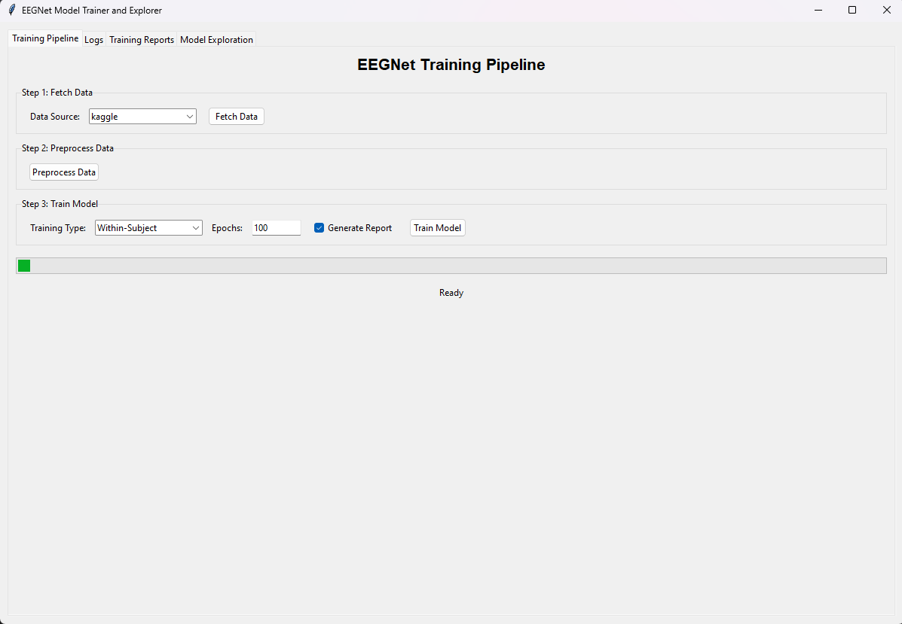
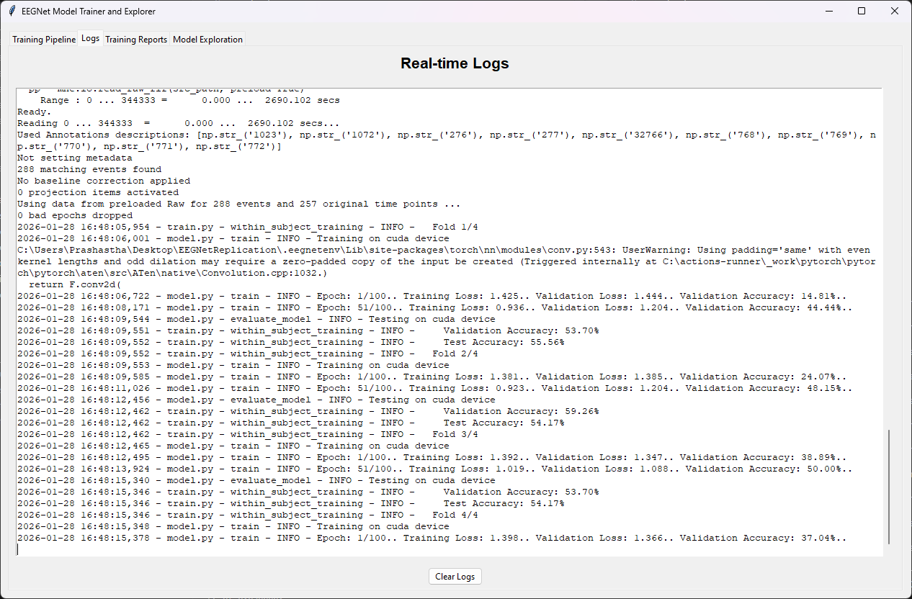
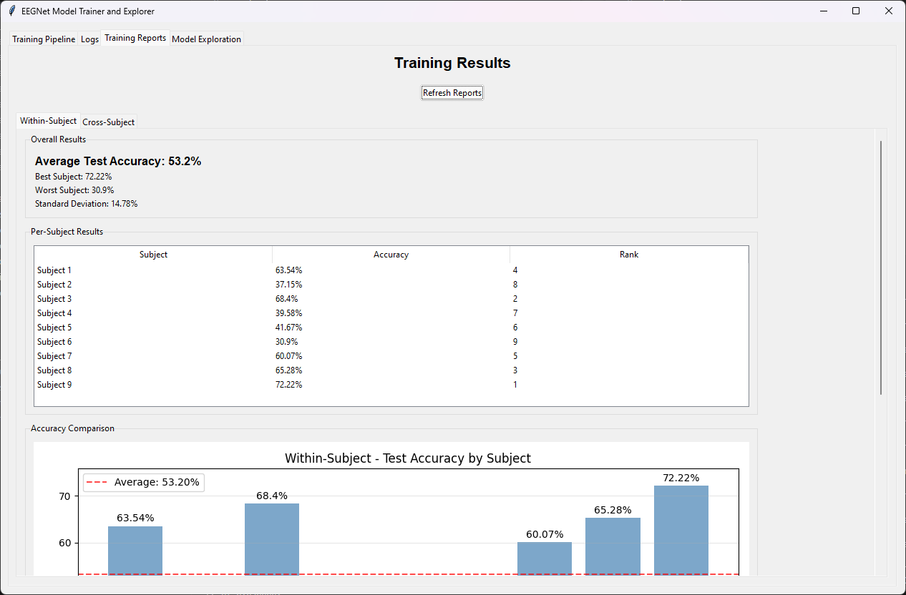
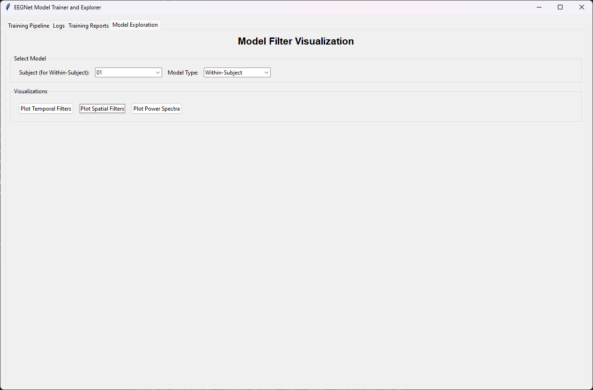

# EEGNetReplication data-science pipeline

Replication of results of the original EEGNet paper. We are focused on the SMR test replication specifically

In this project following steps were done for the replication process:
- fetches data: BCI Competition IV; Dataset 2a,
- pre-process fetched data,
- trains a classifier (CNN Model) to predict SMR actions,
- logs everything to `app.log`.

## Quickstart

```bash
python -m venv .eegnetenv
# Windows: .eegnetenv\Scripts\activate
# macOS/Linux: source .eegnetenv/bin/activate

pip install -e ".[ds,test,lint]"
```

### Run via CLI

1) Fetch data (cached into `data/raw/`) from kaggle

```bash
python -m eegnet_repl.fetch --src kaggle
```

Alternative (Non-functional):
```bash
python -m eegnet_repl.fetch --src moabb
```


2) Preprocess data (cached into `data/processed/`)

```bash
python -m eegnet_repl.dataset --src kaggle
```

3) Train model & Report generation

```bash
python -m eegnet_repl.train --trainingType Within-Subject --epochs 500 --generateReport True
```
- trainingType can be either `Within-Subject` or `Cross-Subject`
- a json report will be generated if the argument value `True` is passed

### Run via GUI

All of the above CLI commands can also be executed via the GUI. On top of that the generated reports can be viewed via the GUI.
The Temporal and Spacial filters can be analysed here as well. The GUI was made to be as intutive as possible.

Run UI

```bash
python -m eegnet_repl.ui
```

1) Train model via GUI
All options similar to the CLI are provided here


2) View logs when training


3) Once training completed, Reports can be viewed here


4) To view and analyze the Spatial and Temporal filters



## Unit tests

1) Unit test for functions in dataset.py

```bash
python -m pytest tests/test_dataset.py -v
```
2) Unit test for functions in model.py

```bash
python -m pytest tests/test_model.py -v
```


